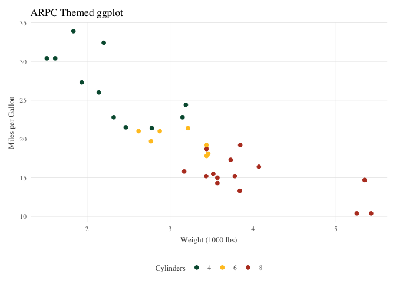
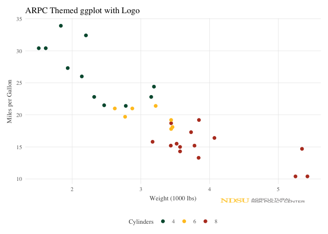
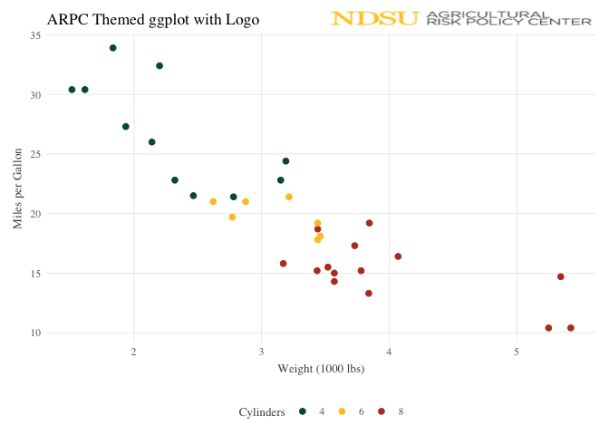

<!-- README.md is generated from README.Rmd. Please edit that file -->

# arpctheme

<!-- badges: start -->
<!-- badges: end -->

The `arpctheme` package provides a ggplot2 theme designed specifically
for ARPC data visualizations. The package also contains an export
function that allows users to consistently export figures in a
standardized formatting.

## Installation

You can install the arpctheme from GitHub as follows:

``` r
# install the remotes package if its not already installed
install.packages("remotes")

# use remotes package to install the arpctheme package from GitHub
remotes::install_github("dylan-turner25/arpctheme")
```

## Quick Start

Below is a standard ggplot scatter plot without the ARPC theme applied.

``` r
library(ggplot2)

# Basic usage a standard ggplot
ggplot(mtcars, aes(x = wt, y = mpg, color = factor(cyl))) +
  geom_point(size = 2) +
  labs(title = "A standard ggplot",
       x = "Weight (1000 lbs)", 
       y = "Miles per Gallon",
       color = "Cylinders")
```


Adding the `+ theme_arpc()` function applies the ARPC theme.

``` r
# Load the arpctheme package
library(arpctheme)
# Apply the ARPC theme
ggplot(mtcars, aes(x = wt, y = mpg, color = factor(cyl))) +
  geom_point(size = 2) +
  labs(title = "ARPC Themed ggplot",
       x = "Weight (1000 lbs)", 
       y = "Miles per Gallon",
       color = "Cylinders") +
  theme_arpc()
```



### Adding an ARPC Logo

Further, an ARPC logo can be added using `+ logo()`. The logo will
automatically be placed in the bottom right corner of the plot, but can
be customized to appear in other locations. The logo position can be
changes by specifying the `position` argument, which can be set to one
of the following: “bottom-right”, “bottom-left”, “top-right”,
“top-left”, “bottom”, “top”, “left”, or “right”. These text based
position arguments will often end up leaving you disappointed with the
placement of the logo. In such case, the logo can also be placed in a
specific location using coordinates, where (0,0) is the bottom left
corner of the plot and (1,1) is the top right corner. Setting
coordinates outside the 0 to 1 range is also possible and will place the
logo into the margins of the plot. The size of the logo can be adjusted
using the `size` argument, which defaults to 0.3. The `alpha` argument
can be used to adjust the transparency of the logo to create a watermark
type effect.

``` r

# Add the ARPC logo to the plot
ggplot(mtcars, aes(x = wt, y = mpg, color = factor(cyl))) +
  geom_point(size = 2) +
  labs(title = "ARPC Themed ggplot with Logo",
       x = "Weight (1000 lbs)", 
       y = "Miles per Gallon",
       color = "Cylinders") +
  theme_arpc() +
  logo()
```


Example: place the logo in the upper right hand corner and increase the
size.

``` r
# Add the ARPC logo to the plot
ggplot(mtcars, aes(x = wt, y = mpg, color = factor(cyl))) +
  geom_point(size = 2) +
  labs(title = "ARPC Themed ggplot with Logo",
       x = "Weight (1000 lbs)", 
       y = "Miles per Gallon",
       color = "Cylinders") +
  theme_arpc() +
  logo(position = c(.75,1.05), size = 0.5)
```



Example: Use the logo as a watermark in the background of the plot.

**Note** the transparency of the logo does not seem to be preserved in
rendered R markdown documents. Exporting as a png will preserve the
transparency though.

``` r
# some made up data
crop_data <- data.frame(
  year = rep(2020:2024, 4),
  yield = c(85, 88, 92, 89, 94,   # Corn
           45, 48, 52, 50, 55,    # Soybeans  
           65, 68, 71, 69, 75, # Wheat
           50,50,50,75,90),   # Rice
      
  crop = rep(c("Corn", "Soybeans", "Wheat","Rice"), each = 5)
)

ggplot(crop_data, aes(x = year, y = yield, color = crop)) +
  geom_line(linewidth = 1.2) +
  geom_point(size = 2.5) +
  theme_arpc() +
  logo(position = c(.5,.7), size = 1, alpha = .2) +
  labs(
    title = "Made Up Crop Yields Over Time",
    subtitle = "",
    x = "Year", 
    y = "Yield (bushels/acre)",
    color = "Crop Type"
  )
```


## Exporting Figures

The `export_arpc()` function provides a standardized way to export
high-quality figures suitable for publications and presentations. It
automatically exports your plots in multiple formats (PNG, PDF, and EPS)
with Computer Modern Roman (CMR) font applied.

### Basic Usage

``` r
# Create a plot
p <- ggplot(mtcars, aes(x = wt, y = mpg, color = factor(cyl))) +
  geom_point(size = 2) +
  labs(title = "Car Weight vs MPG",
       x = "Weight (1000 lbs)", 
       y = "Miles per Gallon",
       color = "Cylinders") +
  theme_arpc() +
  logo()

# Export in all formats (creates my_plot.png, my_plot.pdf, my_plot.eps)
export_arpc(p, "my_plot")
```

### Custom Dimensions and Path

``` r
# Export with custom dimensions to a specific folder
export_arpc(p, "figure1", 
            path = "figures/",
            width = 10, 
            height = 6,
            dpi = 300)
```

### Including Data Export

The function can also export the underlying data as a CSV file alongside
the figures if you pass the dataframe with the plot data to the
`plot_data` argument. This is useful for sharing both the visualizations
and the data used to create them or referencing the underlying data
values of the figures when writing accompanying manuscript text or
quickly calculating one-off statistics.

``` r
# Export figures and data together
export_arpc(p, "analysis_results", 
            plot_data = mtcars,
            path = "output/")

# This creates:
# - analysis_results.png
# - analysis_results.pdf  
# - analysis_results.eps
# - analysis_results.csv
```

## NDSU Color Pallete

The package automatically applies colors from the [NDSU brand
guidlines](https://www.ndsu.edu/sites/default/files/fileadmin/www.ur.ndsu.edu/NDSU-Brand-Guidelines-040125.pdf):

1.  **NDSU Green** (#00583d) - Primary brand color
2.  **NDSU Yellow** (#FFC425) - Secondary brand color  
3.  **Rust** (#B83E27) - Third priority
4.  **Night** (#0F374B) - Fourth priority
5.  Additional colors: Teal, Sage, Dark Green, etc.

### Access Individual Colors

``` r
# return the hex codes for all ndsu colors
ndsu_colors()
#>        green       yellow   dark_green   lime_green         teal lemon_yellow 
#>    "#00583d"    "#FFC425"    "#003524"    "#8ED73B"    "#51ABD0"    "#F4F287" 
#>         sage    pale_sage         rust  morning_sky        night 
#>    "#8ABD78"    "#D7E8C8"    "#B83E27"     "#90DF7"    "#0F374B"

# get the hex code for just ndsu green
ndsu_colors("green")
#>     green 
#> "#00583d"

# get the hex codes for ndsu green and ndsu yellow
ndsu_colors(c("green", "yellow"))
#>     green    yellow 
#> "#00583d" "#FFC425"
```
