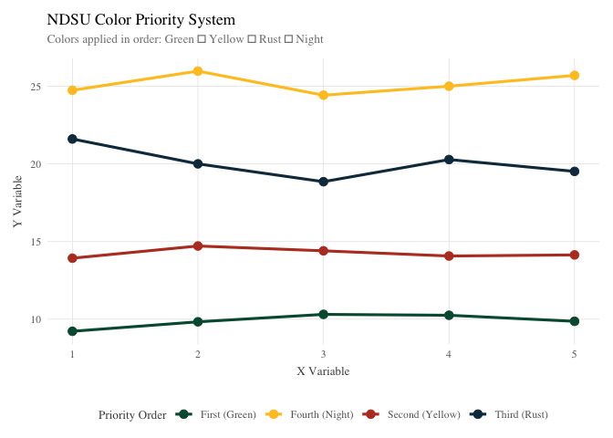
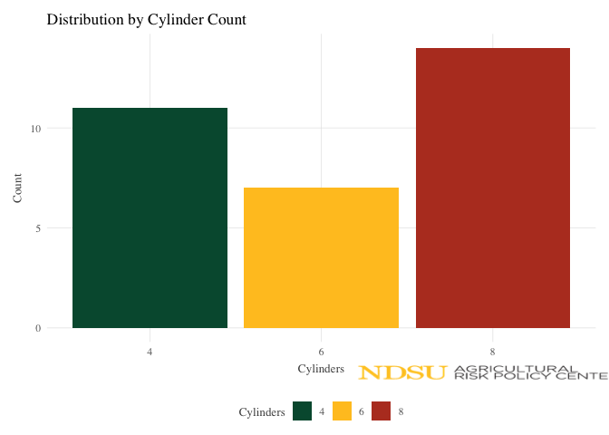

<!-- README.md is generated from README.Rmd. Please edit that file -->

# arpctheme

<!-- badges: start -->
<!-- badges: end -->

The `arpctheme` package provides a comprehensive ggplot2 theme and color
system designed specifically for ARPC (Agricultural Research and Policy
Center) data visualizations. It ensures consistent, professional styling
that incorporates NDSU brand colors and typography.

## Installation

You can install the development version of arpctheme from GitHub with:

``` r
# install.packages("pak")
pak::pak("dylan-turner25/ARPC-Theme")
```

## Features

- **Professional Theme**: Clean, minimal ggplot2 theme with Computer
  Modern Roman typography
- **NDSU Brand Colors**: Automatic application of official NDSU color
  palette
- **Logo Integration**: Easy addition of ARPC logo with automatic
  clipping and smart positioning
- **Export Functions**: Standardized figure export with consistent
  formatting
- **Color Priority System**: Intelligent color assignment (Green →
  Yellow → Rust → Night)

## Quick Start

``` r
library(arpctheme)
library(ggplot2)

# Basic usage - theme with automatic NDSU colors and logo
ggplot(mtcars, aes(x = wt, y = mpg, color = factor(cyl))) +
  geom_point(size = 2) +
  theme_arpc() +
  logo() +  # Automatic clipping and positioning
  labs(title = "ARPC Theme with Automatic NDSU Colors",
       x = "Weight (1000 lbs)", 
       y = "Miles per Gallon",
       color = "Cylinders")
```


## Main Functions

### `theme_arpc()`

The core theme function that provides: - Professional typography using
Computer Modern Roman font - Automatic NDSU color scales for both color
and fill aesthetics - Clean, minimal styling optimized for scientific
publications

``` r
# Basic theme
ggplot(data, aes(x, y, color = group)) +
  geom_point() +
  theme_arpc()

# Customize font size
ggplot(data, aes(x, y)) +
  geom_point() +
  theme_arpc(base_size = 14)
```

### `logo()`

Add the ARPC logo to your plots with flexible positioning and automatic
clipping:

``` r
# Default position (bottom-right) with automatic clipping
+ logo()

# Custom position and size (default size is now 0.3)
+ logo(position = "top-left", size = 0.15, alpha = 0.8)

# Available positions: "bottom-right", "bottom-left", "top-right", 
# "top-left", "bottom", "top", "left", "right"

# Custom coordinates for precise positioning (0-1 = plot area, >1/<0 = margins)
+ logo(position = c(1.1, 0.5), size = 0.12)  # Right margin, center
```

**Note**: The logo function automatically handles
`coord_cartesian(clip = 'off')` so logos can appear in margin areas
without additional setup.

### `export_arpc()`

Export plots with consistent, publication-ready formatting:

``` r
# Export as PNG
export_arpc(plot, "filename", format = "png", width = 8, height = 6)

# Export as PDF for publications
export_arpc(plot, "filename", format = "pdf", width = 10, height = 8)

# High-resolution for presentations
export_arpc(plot, "filename", dpi = 600)
```

## NDSU Color System

The package automatically applies NDSU brand colors in priority order:

1.  **NDSU Green** (#00583d) - Primary brand color
2.  **NDSU Yellow** (#FFC425) - Secondary brand color  
3.  **Rust** (#B83E27) - Third priority
4.  **Night** (#0F374B) - Fourth priority
5.  Additional colors: Teal, Sage, Dark Green, etc.

### Access Individual Colors

``` r
# Get all NDSU colors
ndsu_colors()
#>        green       yellow   dark_green   lime_green         teal lemon_yellow 
#>    "#00583d"    "#FFC425"    "#003524"    "#8ED73B"    "#51ABD0"    "#F4F287" 
#>         sage    pale_sage         rust  morning_sky        night 
#>    "#8ABD78"    "#D7E8C8"    "#B83E27"     "#90DF7"    "#0F374B"

# Get specific colors
ndsu_colors("green")
#>     green 
#> "#00583d"
ndsu_colors(c("green", "yellow", "rust"))
#>     green    yellow      rust 
#> "#00583d" "#FFC425" "#B83E27"
```

### Color Priority Demonstration

``` r
# Create data with 4+ groups to show priority order
test_data <- data.frame(
  x = rep(1:5, 4),
  y = c(rnorm(5, 10), rnorm(5, 15), rnorm(5, 20), rnorm(5, 25)),
  group = rep(c("First (Green)", "Second (Yellow)", "Third (Rust)", "Fourth (Night)"), each = 5)
)

ggplot(test_data, aes(x = x, y = y, color = group)) +
  geom_point(size = 3) +
  geom_line(linewidth = 1.1) +
  theme_arpc() +
  labs(
    title = "NDSU Color Priority System",
    subtitle = "Colors applied in order: Green → Yellow → Rust → Night",
    x = "X Variable",
    y = "Y Variable", 
    color = "Priority Order"
  )
```



### Manual Color Scales

While `theme_arpc()` automatically applies NDSU colors, you can also use
the color scales independently:

``` r
# Use NDSU colors without the full theme
ggplot(data, aes(x, y, color = group)) +
  geom_point() +
  scale_color_ndsu() +
  theme_minimal()

# Different color palettes
+ scale_color_ndsu(palette = "greens")  # Green variants only
+ scale_fill_ndsu(palette = "primary")  # Full primary palette
```

## Examples

### Time Series Plot

``` r
# Sample agricultural data
crop_data <- data.frame(
  year = rep(2020:2024, 3),
  yield = c(85, 88, 92, 89, 94,   # Corn
           45, 48, 52, 50, 55,    # Soybeans  
           65, 68, 71, 69, 75),   # Wheat
  crop = rep(c("Corn", "Soybeans", "Wheat"), each = 5)
)

ggplot(crop_data, aes(x = year, y = yield, color = crop)) +
  geom_line(linewidth = 1.2) +
  geom_point(size = 2.5) +
  theme_arpc() +
  logo(position = "bottom-right", size = 0.08) +
  labs(
    title = "Agricultural Crop Yields Over Time",
    subtitle = "NDSU Agricultural Research - 2020-2024",
    x = "Year", 
    y = "Yield (bushels/acre)",
    color = "Crop Type"
  )
```


### Bar Chart

``` r
ggplot(mtcars, aes(x = factor(cyl), fill = factor(cyl))) +
  geom_bar() +
  theme_arpc() +
  logo(position = "bottom-right", size = 0.5) +
  labs(
    title = "Distribution by Cylinder Count",
    x = "Cylinders",
    y = "Count",
    fill = "Cylinders"
  )
```



## Customization

### Override Colors

Users can override the automatic NDSU colors when needed:

``` r
ggplot(data, aes(x, y, color = group)) +
  geom_point() +
  theme_arpc() +
  scale_color_manual(values = c("red", "blue", "green"))  # Overrides NDSU colors
```

### Font Customization

``` r
# Use different font family
ggplot(data, aes(x, y)) +
  geom_point() +
  theme_arpc(base_family = "Arial")

# Adjust font size
ggplot(data, aes(x, y)) +
  geom_point() +
  theme_arpc(base_size = 16)
```

## Best Practices

1.  **Consistent Usage**: Always use `theme_arpc()` for ARPC
    publications to ensure brand consistency
2.  **Logo Placement**: Choose logo positions that don’t interfere with
    data visualization (automatic clipping ensures logos appear
    correctly)
3.  **Color Priority**: Let the automatic color system handle color
    assignment for consistency
4.  **Export Standards**: Use `export_arpc()` with consistent dimensions
    for publication-ready figures
5.  **Font Considerations**: The default CMR font works well for
    academic publications

## Contributing

This package is designed specifically for ARPC research visualization
needs. For issues or suggestions, please contact the package maintainer.

## License

MIT License - see LICENSE file for details.
